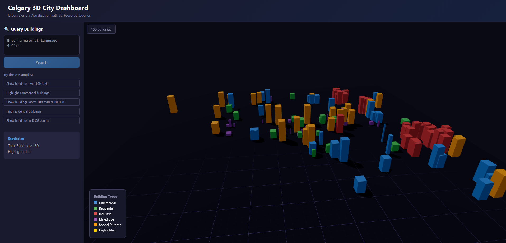

# Calgary 3D City Dashboard

A web-based visualization of Calgary buildings using the Property Assessments Values data set. Buildings can be clicked, inspected, and using natural language queries, highlighted using a desired filter. 


## Features
- **3D Visualization**: Buildings rendered in Three.js based on City of Calgary's *Current Year Property Assessments* dataset. 
- **AI-Powered Queries**: Natural language queries to visually filter buildings using Hugging Face LLM
- **Interactive Data**: Click buildings to view detailed information (Type, Assessed value, Zoning, etc.)
- **Color-Coded Properties**: For viewing comfort, there's visual distinction between Commercial, Residential and Industrial buildings.

## Known Issues
- The data set used is a *property value* dataset, so it does not provide *building* details but rather the details about the property itself like value and zoning. Because of this, the height is assigned based on value, and evenly distributed from highest to lowest value in the current building cache. 
- The scale used to draw buildings could use some fine tuning. Currently, because we do not pull data from a small specific area but rather try to gather a variety of different buildings (in order to demonstrate functionality), the buildings are not orderly drawn and often overlap. 
	- This can be fixed by creating a more specific dataset (eg. merging diff datasets) and fine tuning the scale of buildings to it. 

## Tech Stack
- **Frontend**: React, Three.js (@react-three/fiber), Vite
- **Backend**: Python, Flask
- **AI**: Hugging Face Inference API (Mistral-7B)
- **Data**: City of Calgary's *Current Year Property Assessments* dataset.
## Prerequisites
- Node.js 18+ and npm
- Python 3.9+
- Hugging Face API key (free at [huggingface.co](https://huggingface.co))

  

## Setup Instructions

  

### 1. Clone and Setup Backend


```bash

cd backend

# Create virtual environment

python -m venv venv

source venv/bin/activate  
# On Windows the path is venv\Scripts\activate


# Install dependencies

pip install -r requirements.txt

  

# Create .env file

echo "HUGGINGFACE_API_KEY=your_api_key_here" > .env
```

### 2. To run
```bash

# backend terminal
cd backend
source venv/bin/activate
# windows: source venv/Scripts/activate
python app.py

# in a frontend terminal
cd frontend
npm run dev

```